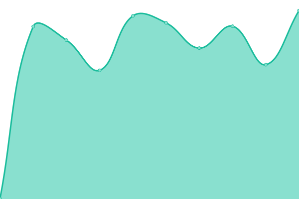
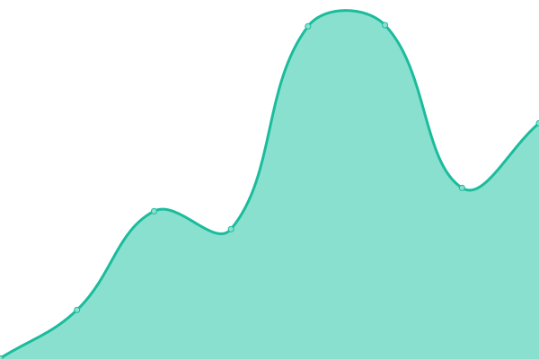

# [📈 Live Status](https://status.nekozuki.me): <!--live status--> **🟩 All systems operational**

This repository contains the open-source uptime monitor and status page for [AyumuNekozuki](https://blog.nekozuki.me/), powered by [Upptime](https://github.com/upptime/upptime).

With [Upptime](https://upptime.js.org), you can get your own unlimited and free uptime monitor and status page, powered entirely by a GitHub repository. We use [Issues](https://github.com/AyumuNekozuki/upptime/issues) as incident reports, [Actions](https://github.com/AyumuNekozuki/upptime/actions) as uptime monitors, and [Pages](https://status.nekozuki.me) for the status page.

<!--start: status pages-->
<!-- This summary is generated by Upptime (https://github.com/upptime/upptime) -->
<!-- Do not edit this manually, your changes will be overwritten -->
<!-- prettier-ignore -->
| URL | Status | History | Response Time | Uptime |
| --- | ------ | ------- | ------------- | ------ |
|  [Mastodon](https://mstdn.nekozuki.me) | 🟩 Up | [mastodon.yml](https://github.com/AyumuNekozuki/upptime/commits/HEAD/history/mastodon.yml) | 

 2005ms
     
 | 

<a href="https://status.nekozuki.me/history/mastodon">93.12%</a>
    

|  [Misskey](https://mi.nekozuki.me) | 🟩 Up | [misskey.yml](https://github.com/AyumuNekozuki/upptime/commits/HEAD/history/misskey.yml) | 

 490ms
     
 | 

<a href="https://status.nekozuki.me/history/misskey">100.00%</a>
    

|  [Blog](https://blog.nekozuki.me) | 🟩 Up | [blog.yml](https://github.com/AyumuNekozuki/upptime/commits/HEAD/history/blog.yml) | 

 316ms
     
 | 

<a href="https://status.nekozuki.me/history/blog">100.00%</a>
    

<!--end: status pages-->

[**Visit our status website →**](https://status.nekozuki.me)

## 📄 License

- Powered by: [Upptime](https://github.com/upptime/upptime)
- Code: [MIT](./LICENSE) © [AyumuNekozuki](https://blog.nekozuki.me/)
- Data in the `./history` directory: [Open Database License](https://opendatacommons.org/licenses/odbl/1-0/)
